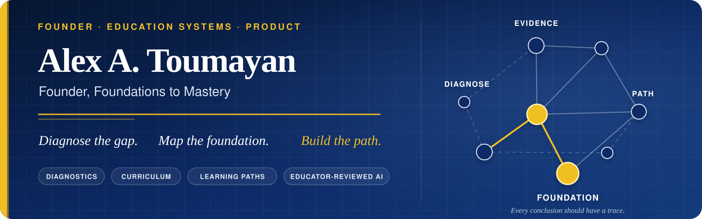

  

## Building the infrastructure between “a student is struggling” and “here is exactly what comes next.”

I’m Alex, founder of **Foundations to Mastery**. I work across product strategy, software engineering, curriculum, data, and educator operations to answer three practical questions:

  <strong>What does this learner actually understand?</strong> 
  <strong>Where does the foundation break?</strong> 
  <strong>What should we build next?</strong>

Foundations to Mastery connects assessment evidence to prerequisite maps, personalized learning paths, instructional materials, tutor workflows, and ongoing reassessment. The goal is not simply to produce a score. It is to produce an explanation that a learner, family, and educator can act on.

## The system I’m building

| Layer | What it is designed to do |
| --- | --- |
| **Diagnose** | Collect meaningful evidence through adaptive, open-response assessments rather than reducing a learner to one score. |
| **Map** | Trace mistakes through prerequisite relationships to find where the underlying foundation begins to break. |
| **Build** | Turn findings into sequenced lessons, practice, checkpoints, and personalized learning paths. |
| **Support** | Give learners, families, tutors, and staff the tools and context needed to carry the plan out. |
| **Improve** | Use progress and reassessment to refine the path while keeping educator judgment in the loop. |

## Where I work

**Founder & product strategy** · **full-stack systems** · **diagnostic architecture** · **curriculum engineering** · **data and evidence models** · **educator-reviewed AI** · **operational tooling**

I’m especially interested in the seams between disciplines: where assessment design becomes data architecture, curriculum becomes a dependency graph, AI becomes a proposal an educator can audit, and product operations determine whether a strong idea can actually reach a family.

## How I build

- **Evidence before confidence.** The system should distinguish what was measured, what remains uncertain, and why it reached a conclusion.
- **AI should remove repetitive work—not human judgment.** Automation can draft, organize, and surface patterns; an educator remains responsible for consequential decisions.
- **Every conclusion should have a trace.** Inputs, assumptions, provenance, and next actions should be visible enough to inspect.
- **Durable workflows beat one-off artifacts.** I prefer systems that can be repeated, tested, versioned, and improved.
- **Privacy and security are product features.** Learner data, assessment content, and internal decision logic deserve deliberate boundaries.

## Selected public work

| Project | Focus |
| --- | --- |
| [**Data Science Portfolio**](https://github.com/AlexToumayan/data-science-portfolio) | Applied machine learning, statistical modeling, Bayesian inference, and reinforcement learning. |
| [**ChatGPT → Anki Converter**](https://github.com/AlexToumayan/Chat-GPT-Flashcards-To-Anki-Converter) | Study-workflow automation that turns structured flashcards into importable Anki decks. |
| [**Berkeley Projects**](https://github.com/AlexToumayan/BerkeleyProjects) | Java, data structures, graph traversal, algorithms, and procedural generation. |

Most current Foundations to Mastery product and curriculum work is private by design. I share selected research, tools, and architecture examples when they can be published without exposing learner data, proprietary curriculum, or secure assessment material.

## Why this work

My path into this work runs through tutoring, teaching, science, data, and software. That mix is why I treat learning problems as both human and systems problems: the diagnosis has to be rigorous, but the result also has to make sense to the person who will use it.
