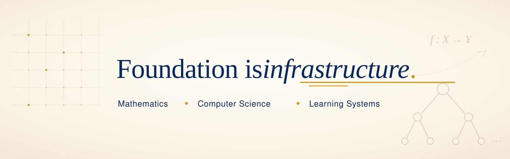

### Alex A. Toumayan

**Software engineer building education infrastructure.**

I build full-stack tools, curriculum systems, and research workflows for Foundations to Mastery: making student progress easier to see, explain, and act on.

---

#### Current Work

| Track | What I am building |
| --- | --- |
| **F2M Platform** | Student and tutor tools for diagnostics, course materials, session reports, file access, and admin workflows. |
| **Research Notebooks** | Public analyses on learning gaps, academic recovery, teacher workload, tutoring access, and de-identified F2M outcomes. |
| **Course Infrastructure** | Markdown, LaTeX, KaTeX, and automation pipelines for structured STEM materials and interactive programming exercises. |

#### Engineering Focus

`full-stack product engineering` · `data and research tooling` · `curriculum systems` · `developer workflow` · `AI-assisted internal tools`

#### Principles

- Make the system observable: inputs, assumptions, student state, and next actions should be visible.
- Prefer durable workflows over one-off artifacts.
- Keep public work honest: sources, limitations, reproducibility notes, and clear boundaries around private student data.

#### Public Work

Public repositories are being reorganized around the work above. Most F2M application code stays private while I prepare public notebooks, infrastructure examples, and cleaned project write-ups.
