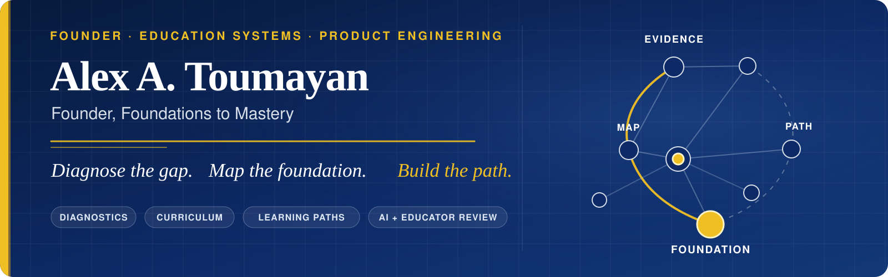

  <strong>Founder of Foundations to Mastery · Education systems builder · Product engineer</strong>

  

## Building systems that turn learning evidence into action

I founded **Foundations to Mastery** around a simple belief: a learner should not be defined by the point where their foundation became uneven.

Capable students can carry hidden gaps for years. The consequences often appear much later—as confusion, avoidance, slow progress, or the belief that they are simply “bad” at a subject. My work is to make those gaps specific: locate where understanding first became unstable, show the evidence behind that conclusion, and turn it into a clear instructional path.

I work across **diagnostic design, curriculum architecture, data systems, educator workflows, and full-stack product engineering**—connecting a learner’s intake to diagnosis, personalized instruction, practice, reassessment, and measurable progress.

> A learner should never be reduced to a grade-level label. We should be able to show what is secure, where the foundation begins to break, and what to teach next.

## What I am building

| Layer | Purpose |
| --- | --- |
| **Diagnostics** | Gather evidence across standards, representations, and response types without collapsing a learner into one score. |
| **Foundation maps** | Trace visible difficulty through prerequisite structure to the earliest point that needs repair. |
| **Personalized paths** | Convert evidence into sequenced instruction, practice, checkpoints, and a realistic route back to mastery. |
| **Tutor and family systems** | Give educators clear next actions and families understandable reports, materials, progress, and program scope. |
| **Curriculum infrastructure** | Turn structured source content into lessons, workbooks, assessments, digital activities, and reproducible publications. |
| **Human-accountable AI** | Use models to assist with grading, synthesis, and drafting while keeping evidence, review, and responsibility visible. |

## The loop

  <strong>Intake → Diagnose → Map the foundation → Build the path → Teach → Re-check</strong>

The point is not a prettier dashboard. The point is to give every conclusion a trace, every trace a next action, and every action a way to be checked again.

## Working across

`Product architecture` · `Full-stack applications` · `Postgres and data modeling` · `Diagnostic reasoning` · `Curriculum systems` · `Assessment design` · `Research tooling` · `Markdown / LaTeX / KaTeX publishing` · `AI-assisted educator workflows` · `Testing and quality assurance`

## How I build

- **Evidence before labels.** Conclusions should come from what the learner actually did—not assumptions based on age, course, or grade.
- **Systems before one-off artifacts.** Diagnostics, curriculum, reports, and workflows should remain useful as the program grows.
- **AI proposes; an educator confirms.** Automation should remove repetitive work without removing human accountability.
- **Honest boundaries.** Confidence, limitations, provenance, and unresolved questions should stay visible.
- **Privacy by design.** Student information belongs behind deliberate access controls, not inside public demos or portfolio claims.

## Selected public work

| Repository | Focus |
| --- | --- |
| [**Data Science Portfolio**](https://github.com/AlexToumayan/data-science-portfolio) | Machine learning, statistical modeling, search, inference, reinforcement learning, and neural networks. |
| [**ChatGPT to Anki Converter**](https://github.com/AlexToumayan/Chat-GPT-Flashcards-To-Anki-Converter) | A practical learning tool that turns structured study content into importable Anki flashcards. |
| [**Berkeley Projects**](https://github.com/AlexToumayan/BerkeleyProjects) | Data structures, graph traversal, semantic analysis, procedural generation, and object-oriented software design. |

Most Foundations to Mastery application code and curriculum systems remain private while the platform is in active development. Public repositories here contain selected tools, coursework, experiments, and project write-ups that can be shared responsibly.

---

  <em>Make the struggle specific. Make the evidence visible. Make the next step clear.</em>

